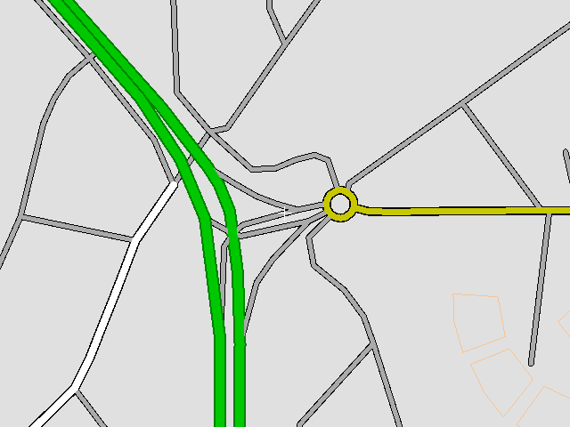

#### Программа для навигации и набор утилит для создания карт для неё

Under construction! / В процессе разработки!
* * *
Please support this project via GitTip:
https://www.gittip.com/denizzzka/
* * *
Use "--recursive" for cloning this repository:
```
git clone --recursive git://github.com/denizzzka/gis-stuff.git
```
For passing options to the compiler use ARGS variable:
```
make -B ARGS="-d -unittest -g -debug -debug=osmpbf"
```
("-B" is for unconditionally make target)
If no options are passed "-release" option will be used.

* * *


* * *

Roadmap:
--------------

- [x] Data Layers
    - [ ] Data support for: cars, trucks, pedestrians, planes, ships etc
    - [ ] Isohypses
    - [x] Pathfinding
        - [ ] Given the altitude (for mountains)

- [x] Scene visualisation
    - [x] Software
        - [ ] Software 3D
    - [ ] OpenGL

- [ ] Text search

- [ ] Data generalization
    - [x] By reducing points

- [ ] Internal format of maps
    - [ ] "Map Polish" format support (*.mp)

- [ ] Support input from a GPS sensor (NMEA)
    - [ ] GLONASS
    - [ ] Binary protocols
    - [ ] Another sensors: compass, acceleration, altimeter

- [ ] Downloading maps from a server
    - [ ] Download all maps which contains path

- [ ] Портирование программы на какую-нибудь мобильную платформу
