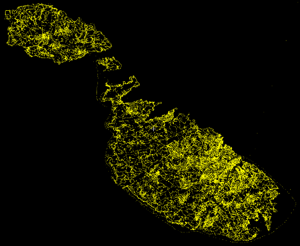
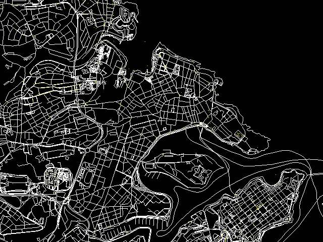
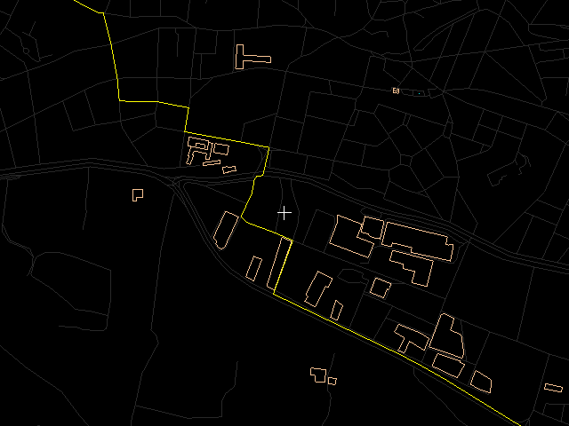

#### Программа для навигации и набор утилит для создания карт для неё

Under construction! / В процессе разработки!

Use "--recursive" for cloning this repository:
```
git clone --recursive git://github.com/denizzzka/gis-stuff.git
```
For passing options to the compiler use ARGS variable:
```
make -B ARGS="-d -unittest -g -debug -debug=osmpbf"
```
("-B" is for unconditionally make target)
If no options are passed "-release" option will be used.

* * *





* * *

Roadmap:
--------------

- [ ] tasklist test

- Хранение геоданных слоями (для легковых авто, грузовых, пешеходов, самолётов, кораблей)
    - Хранение изолиний
    - Прокладка маршрутов с учётом высот

- Сцена (выборка объектов для отображения в соответствии с общими свойствами сцены: углом, азимутом, высотой и т.д.)
    
- Визуализация сцены
    - Софтверная сцена (отрисовка перспективы - переносимый на разные платформы интерфейс)
    - Отрисовка 3Д средствами OpenGL (для платформ, где хорошо работает OpenGL)

- Текстовый поиск POI

- Загрубление данных на разных режимах детализации (увеличения)

- Чтение "польского формата" ("Map Polish", ".mp")

- Конвертер карт
    - Упаковка данных с целью уменьшения размера файлов данных

- Поддержка ввода данных с датчика GPS (NMEA)
    - Глонасс
    - Бинарные протоколы
    - Другие датчики (компас, датчик ускорений, альтиметр)

- Загрузка с сервера карт текущего местоположения
    - Загрузка всех карт, через которые проходит заданный маршрут

- Портирование программы на какую-нибудь мобильную платформу
