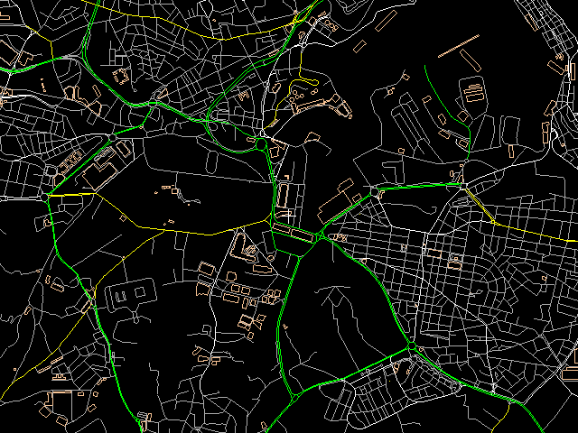

#### Navigation app and tools to convert maps for it

Under heavy development!
* * *
Use "--recursive" for cloning this repository:
```
git clone --recursive git://github.com/denizzzka/gis-stuff.git
```
Build using DUB:
```
$ cd gis-stuff
$ dub -q --arch=x86 --build=unittest build
```
Run:
```
./gis-stuff --verbose malta-latest.osm.pbf
```

* * *


* * *

Roadmap:
--------------

- [x] Data Layers
    - [ ] Data support for: cars, trucks, pedestrians, planes, ships etc
    - [ ] Isohypses
    - [x] Pathfinding
        - [ ] Given by altitude (for mountains)

- [x] Scene visualisation
    - [x] Software
        - [ ] Software 3D
    - [ ] OpenGL

- [ ] Text search

- [ ] Data generalization
    - [x] By reducing points

- [ ] Internal format of maps
    - [ ] "Map Polish" format support (*.mp)

- [ ] Support input from a GPS sensor (NMEA)
    - [ ] GLONASS
    - [ ] Binary protocols
    - [ ] Another sensors: compass, acceleration, altimeter

- [ ] Downloading maps from the server
    - [ ] Download all maps which contains some path

- [ ] Porting app to any mobile platform
